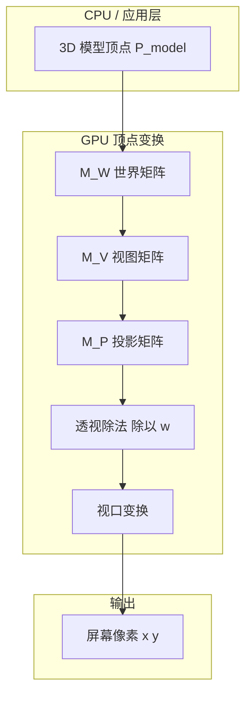

# 00 — 导读：3D 渲染与矩阵

## 一句话总结

**3D 渲染**就是把三维世界里 countless 个点的坐标，一步步换算成屏幕上的像素颜色；**矩阵**就是每一步换算用的「万能公式表」。

---

## 3D 渲染到底在做什么？

想象你在玩一个 3D 游戏：

- 场景里有角色、地面、树木（都在三维空间里）
- 你透过「相机」看到画面（其实是一块 flat 的屏幕）
- GPU 每帧要做的事：**决定屏幕上每个像素该显示什么颜色**

要做到这一点，GPU 必须回答：

1. 这个物体的顶点在场景的什么位置？（**世界矩阵**）
2. 从相机看过去，它在哪里？（**视图矩阵**）
3. 投影到 2D 画面后，它在哪？（**投影矩阵**）
4. 最终落在屏幕的哪个像素？（**视口变换**）

前三步就是 DX11 / 图形学里常说的 **MVP 变换**。

---

## 生活类比：舞台摄影

| 渲染概念 | 生活类比 |
|----------|----------|
| 模型空间 | 演员在自己化妆间里的位置（以化妆间为原点） |
| 世界矩阵 | 演员走上舞台，站到指定位置、朝向观众 |
| 视图矩阵 | 摄影师选机位：站哪、朝哪拍 |
| 投影矩阵 | 镜头是广角还是长焦，画框多大 |
| 屏幕像素 | 冲洗出的照片上的每一个点 |

---

## 从顶点到像素：总览图



一个顶点经历的完整旅程：

```
P_model  →  P_world  →  P_view  →  P_clip  →  P_ndc  →  屏幕坐标
  模型       世界        相机        裁剪        标准化      像素
```

---

## 为什么用 4×4 矩阵？

三维空间里有 **平移、旋转、缩放** 三种操作。用 3×3 矩阵只能做旋转和缩放，**平移**需要凑成 4×4 齐次矩阵才能和其他变换统一写成一次矩阵乘法。

齐次坐标把点写成 `(x, y, z, w)`，其中 `w` 通常为 1。这样：

```
P_world = M_W × P_model
```

一行公式就能完成「缩放 → 旋转 → 平移」的组合。

---

## 本项目的定位

本仓库是一个 **可视化教学工具**，不是完整的 DX11 引擎：

- 用 Three.js / WebGL 演示变换原理（右手坐标系、Y-up）
- 实时显示 World / View / Projection / MVP 矩阵数值
- 提供 DX11 左手坐标系对照模式，帮助对照官方文档
- **变换链路的数学原理与 DX11 完全一致**，差异主要在坐标系约定和 NDC 深度范围

---

## 对照本项目

| 想理解的概念 | 在网页里怎么做 |
|--------------|----------------|
| 整体管线 | 打开网页，看中间 3D 视口 + 右侧四个矩阵块 |
| 一个点怎么变 | 左侧「坐标追踪」输入 (1,1,1)，点「追踪」 |
| 分步学习 | 右侧「教学脚本」→ 开始脚本，共 8 步 |
| 公式说明 | 右侧「公式说明」切换 World / View / Projection / MVP 标签 |

---

## 下一步

继续阅读 [01-coordinate-spaces.md](./01-coordinate-spaces.md)，搞清楚「模型空间、世界空间、相机空间……」这些名词各自是什么意思。
