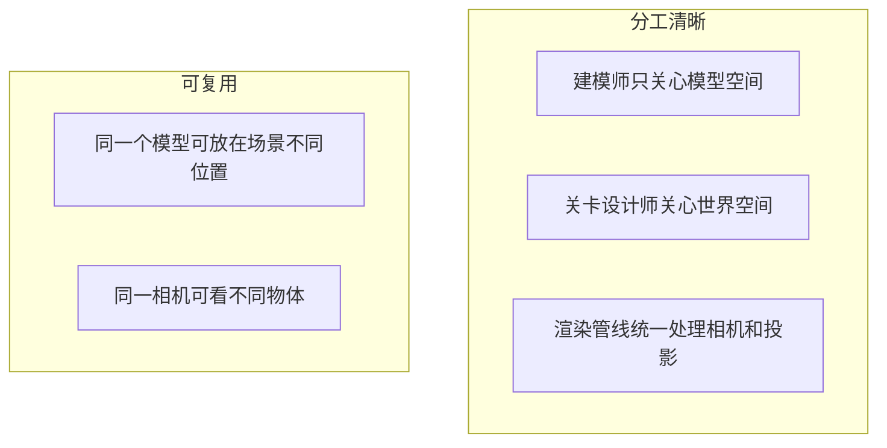

# 01 — 坐标空间：顶点经历的六个「地址」

## 一句话总结

同一个三维点，在不同阶段会用不同的坐标系来描述它的位置——就像同一个包裹在「发货地地址 → 中转站 → 目的地」之间换标签。

---

## 生活类比：快递包裹换地址

| 坐标空间 | 类比 | 回答的问题 |
|----------|------|------------|
| **模型空间** (Model / Local) | 包裹在工厂里的相对位置 | 这一点在模型自身哪里？ |
| **世界空间** (World) | 包裹在地图上的经纬度 | 这一点在整个场景哪里？ |
| **相机空间** (View / Camera / Eye) | 以快递员视角描述位置 | 这一点在相机前方多远、偏左还是偏右？ |
| **裁剪空间** (Clip) | 还没贴邮票前的标准化信封 | 这一点能否被「画框」装下？ |
| **NDC** (Normalized Device Coordinates) | 统一格式的 -1 到 1 坐标 | 在标准立方体里占哪？ |
| **屏幕空间** (Screen) | 最终快递单上的门牌号 | 在显示器第几行第几列像素？ |

---

## 坐标空间流水线

---

## 各空间详解

### 1. 模型空间 (Model Space)

- 以**模型自身**为原点
- 建模软件（Blender、3ds Max）里编辑顶点时用的就是这个空间
- 例如：一个立方体中心在原点，角点可能是 `(±1, ±1, ±1)`

### 2. 世界空间 (World Space)

- 整个游戏场景的「大地图」坐标系
- 所有物体、光源、相机都在这个世界坐标里有一个位置
- **世界矩阵 M_W** 负责：模型空间 → 世界空间

### 3. 相机空间 (View / Camera Space)

- 以**相机**为原点，相机朝向为 -Z（或 +Z，取决于 API 约定）
- 「在相机左边 2 米、前方 5 米」这种描述就在相机空间
- **视图矩阵 M_V** 负责：世界空间 → 相机空间

### 4. 裁剪空间 (Clip Space)

- 投影矩阵作用后的空间，坐标仍是 `(x, y, z, w)` 四维
- GPU 会丢弃落在 `[-w, w]` 范围外的点（被视锥体裁掉）
- **投影矩阵 M_P** 负责：相机空间 → 裁剪空间

### 5. NDC（标准化设备坐标）

- 对裁剪空间做 **透视除法**：`(x/w, y/w, z/w)`
- x、y 通常在 `[-1, 1]`，表示在屏幕上的相对位置
- z 表示深度（WebGL: `[-1,1]`，DX11: `[0,1]`）

### 6. 屏幕空间 (Screen Space)

- 把 NDC 映射到实际像素：`(0, 0)` 到 `(width-1, height-1)`
- 这一步叫 **视口变换 (Viewport Transform)**，通常由 API 自动完成

---

## 为什么分这么多步？

- **模型**可以复用：同一个 mesh，换不同的世界矩阵就能在场景里放 100 棵树
- **相机**可以独立移动：世界矩阵不变，只改视图矩阵就能「环绕观察」
- **投影**可以切换：同一视角下，透视 / 正交只需换投影矩阵

---

## 齐次坐标 w 是什么？

四维向量 `(x, y, z, w)` 中：

- `w = 1` 通常表示一个**点**
- `w = 0` 通常表示一个**方向**（平移不影响它）
- 透视投影后 `w ≠ 1`，**除以 w** 才得到 NDC——这就是「近大远小」的数学来源

---

## 对照本项目

打开网页，在左侧 **「坐标追踪」** 面板：

1. 输入模型空间点，例如 `X=1, Y=1, Z=1`
2. 点击 **「追踪」**
3. 观察五行的变化：

| 显示标签 | 对应空间 | 公式 |
|----------|----------|------|
| 模型空间 | Model | 输入 |
| 世界空间 | World | `= M_W × P_model` |
| 相机空间 | View | `= M_V × P_world` |
| 裁剪空间 | Clip | `= M_P × P_view` |
| NDC | NDC | `= P_clip / w` |

代码实现见 [`src/engine/transforms.js`](../src/engine/transforms.js) 中的 `tracePoint()` 函数。

拖动 World / View / Projection 任意滑块，追踪结果会**实时更新**，直观感受每个矩阵改变了哪些数值。

---

## 下一步

- 世界矩阵详解 → [02-world-matrix.md](./02-world-matrix.md)
- 视图矩阵详解 → [03-view-matrix.md](./03-view-matrix.md)
- 投影矩阵详解 → [04-projection-matrix.md](./04-projection-matrix.md)
