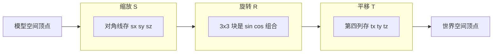

# 02 — 世界矩阵 (World Matrix)

## 一句话总结

**世界矩阵回答：这个物体在场景的哪里、朝哪、多大？** 它把模型从「自己的坐标系」搬到「游戏世界的大地图」上。

---

## 生活类比：舞台布景

想象一个木偶：

- 在**化妆间**里，木偶以自身中心为原点——这是**模型空间**
- 导演说：「走到舞台中央，朝观众，放大 1.5 倍」——这就是**世界矩阵**在做的事
- 走上舞台后，木偶的位置就是**世界空间**坐标

世界矩阵 = **平移 + 旋转 + 缩放** 的组合。

---

## 数学公式

本项目中的计算顺序（见 `buildWorldMatrix()`）：

```
M_W = T × R_Y × R_X × R_Z × S
```

| 符号 | 含义 | 网页参数 |
|------|------|----------|
| **T** | 平移 (Translation) | tx, ty, tz |
| **R_Y** | 绕 Y 轴旋转 (Yaw) | ry |
| **R_X** | 绕 X 轴旋转 (Pitch) | rx |
| **R_Z** | 绕 Z 轴旋转 (Roll) | rz |
| **S** | 统一缩放 (Scale) | scale |

乘法顺序的含义：**先缩放，再旋转，最后平移**（从右往左作用于顶点）。

---

## 三种基本变换



### 平移矩阵 T

把物体从本地原点移到 `(tx, ty, tz)`。矩阵第四列 `[tx, ty, tz, 1]` 就是位移量，其余接近单位矩阵。

### 旋转矩阵 R

绕 X / Y / Z 轴旋转，3×3 左上角块由 sin、cos 组成，行列式 = 1（不改变体积）。

- **Pitch (rx)**：抬头/低头，绕 X 轴
- **Yaw (ry)**：左右转，绕 Y 轴
- **Roll (rz)**：侧倾，绕 Z 轴

### 缩放矩阵 S

对角线 `(sx, sy, sz, 1)`。本项目使用**统一缩放**，三个轴相同。

---

## 单位矩阵 = 「什么都不做」

当 tx=ty=tz=0、旋转全 0、scale=1 时，世界矩阵接近**单位矩阵 I**：

```
[ 1  0  0  0 ]
[ 0  1  0  0 ]
[ 0  0  1  0 ]
[ 0  0  0  1 ]
```

此时模型空间坐标 = 世界空间坐标，物体留在场景原点。

---

## 矩阵长什么样？

以「平移 (3, 1, -2)」为例，行主序显示时第四列变化最明显：

```
[ 1  0  0  3 ]
[ 0  1  0  1 ]
[ 0  0  1 -2 ]
[ 0  0  0  1 ]
```

旋转时，左上角 3×3 块会出现非 0 的 sin/cos 值；缩放时对角线变为 scale。

---

## 常见疑问

**Q：为什么先缩放再旋转，不是先旋转再缩放？**

A：乘法顺序决定效果。`T × R × S` 表示：顶点先被 S 作用，再 R，再 T。若顺序反了，旋转中心会偏移，物体可能「绕错误的位置转圈」。

**Q：多个相同模型怎么放？**

A：每个实例用**不同的世界矩阵**，模型数据只存一份。100 棵树 = 1 个 mesh + 100 个 M_W。

---

## 对照本项目

| 操作 | 位置 |
|------|------|
| 调节平移/旋转/缩放 | 左侧 **世界矩阵 (World)** 面板 |
| 看实时数值 | 右侧矩阵看板 **World (M_W)**，红色标签 |
| 看公式说明 | 右侧 **公式说明 → World** 标签 |
| 教学脚本 Step 1～3 | 从默认状态 → 平移 → 旋转缩放 |

**动手实验：**

1. 重置全部（按 `R` 或点顶栏「重置」）
2. 只改 tx=3, ty=1, tz=-2 → 观察模型移动，矩阵第四列变化
3. 再加 Yaw=45°, Pitch=20°, Scale=1.5 → 观察 3×3 旋转块和对角线

代码：`src/engine/transforms.js` → `buildWorldMatrix()`

---

## 下一步

物体已经在世界空间里了，接下来需要「相机怎么看它」→ [03-view-matrix.md](./03-view-matrix.md)
