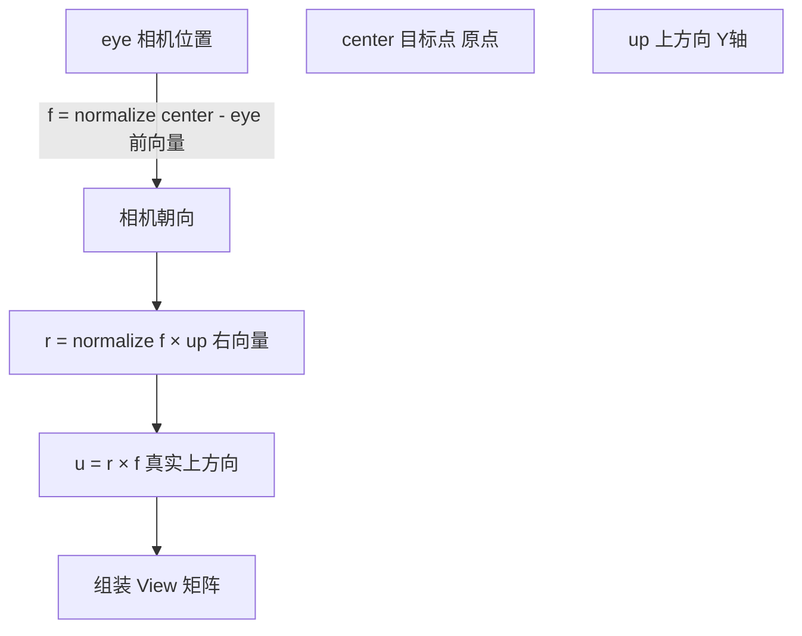
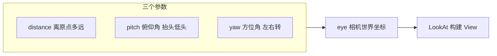
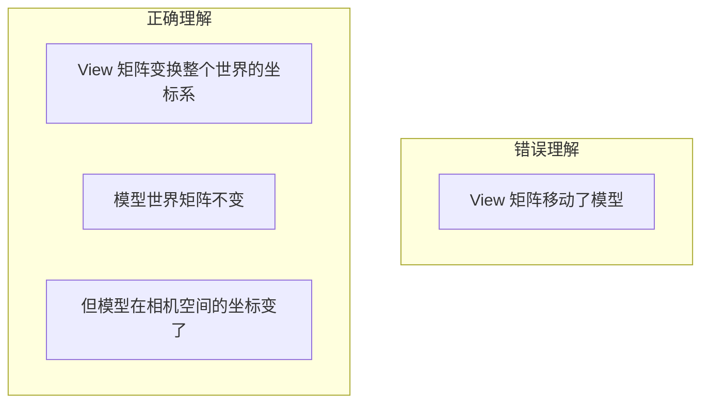

# 03 — 视图矩阵 (View Matrix)

## 一句话总结

**视图矩阵回答：从相机的视角看，世界里的点在哪里？** 它把整个世界「搬到相机面前」，让相机永远位于原点、朝向前方。

---

## 生活类比：摄影师不动，世界转过来

真实世界里，你可以：

- **移动相机**去拍物体，或
- **移动物体**到相机前，相机不动

在 GPU 里，为了简化计算，通常**假设相机固定在原点**，用视图矩阵把**整个世界反向变换**到相机坐标系。

> 视图矩阵 = 相机世界变换矩阵的**逆矩阵**

---

## 相机三要素：LookAt

构建视图矩阵需要三个向量（本项目目标点固定为原点）：

| 参数 | 含义 | 本项目 |
|------|------|--------|
| **eye** | 相机位置 | 由距离、俯仰、方位（球坐标）计算 |
| **center / target** | 相机看向的点 | 固定 `(0, 0, 0)` |
| **up** | 世界上方向 | 固定 `(0, 1, 0)` Y 轴朝上 |



### 推导步骤

1. **前向量** f = normalize(center - eye) — 相机看向哪里
2. **右向量** r = normalize(f × up) — 相机右侧
3. **上向量** u = r × f — 修正后的真正「上」
4. 旋转部分用 r、u、-f 作为基向量
5. 平移部分把 eye 变换到相机空间 → 相机位于原点

---

## 球坐标 → 相机位置

本项目用**距离 + 俯仰 + 方位**控制相机（见 `getCameraPosition()`）：

```
x = distance × cos(pitch) × sin(yaw)
y = distance × sin(pitch)
z = distance × cos(pitch) × cos(yaw)
```



- **distance 增大** → 相机离场景更远，物体看起来更小
- **pitch 增大** → 相机抬高，俯视场景
- **yaw 增大** → 相机绕 Y 轴环绕

---

## 关键直觉：View 不是「移动模型」



教学脚本 Step 4 特意切到**侧视预设**，让你观察：模型参数没变，但 View 矩阵变了，画面从正面变成侧面——因为「观察坐标系」变了。

---

## 视图矩阵 vs 相机矩阵

| 名称 | 关系 |
|------|------|
| **Camera / World Matrix** | 描述相机在世界中的位置和朝向 |
| **View Matrix** | Camera Matrix 的**逆** |

为什么用逆？因为我们想要 `P_view = M_V × P_world`，而 M_V 把世界原点变到相机前方。

代码逻辑（`buildViewMatrix()`）：

```javascript
cameraWorld.lookAt(eye, target, up)
cameraWorld.setPosition(eye)
return cameraWorld.invert()  // View = inverse(CameraWorld)
```

---

## 常见疑问

**Q：改 View 和改 World 有什么区别？**

A：改 World 是**物体在场景里动**；改 View 是**观察角度变**。最终画面可能相似，但矩阵含义不同。在有多物体的真实场景里，View 影响所有物体，World 只影响单个物体。

**Q：OrbitControls 拖动画布时改的是哪个矩阵？**

A：Three.js 的 OrbitControls 本质在改**相机位置/朝向**，等价于修改 View（或 Camera）相关参数。本项目的 View 面板用球坐标参数化同一效果。

---

## 对照本项目

| 操作 | 位置 |
|------|------|
| 调节距离/俯仰/方位 | 左侧 **视图矩阵 (View)** 面板 |
| 快速切换视角 | 正视 / 侧视 / 俯视 / 等轴测 预设按钮，或快捷键 1/2/3/4 |
| 看实时数值 | 右侧矩阵看板 **View (M_V)**，青色标签 |
| 教学脚本 Step 4～5 | 侧视预设 → pitch=40, distance=16 |

**动手实验：**

1. 先设置 World：tx=3, ry=45（让模型明显偏移）
2. 点 **侧视** 预设 → 理解 View 改变时 World 矩阵数值不变
3. 增大 distance → 物体在画面中变小
4. 增大 pitch → 从俯视角度看模型

代码：`src/engine/transforms.js` → `buildViewMatrix()`、`getCameraPosition()`

---

## 下一步

点已经在相机空间了，接下来要「拍成 2D」→ [04-projection-matrix.md](./04-projection-matrix.md)
