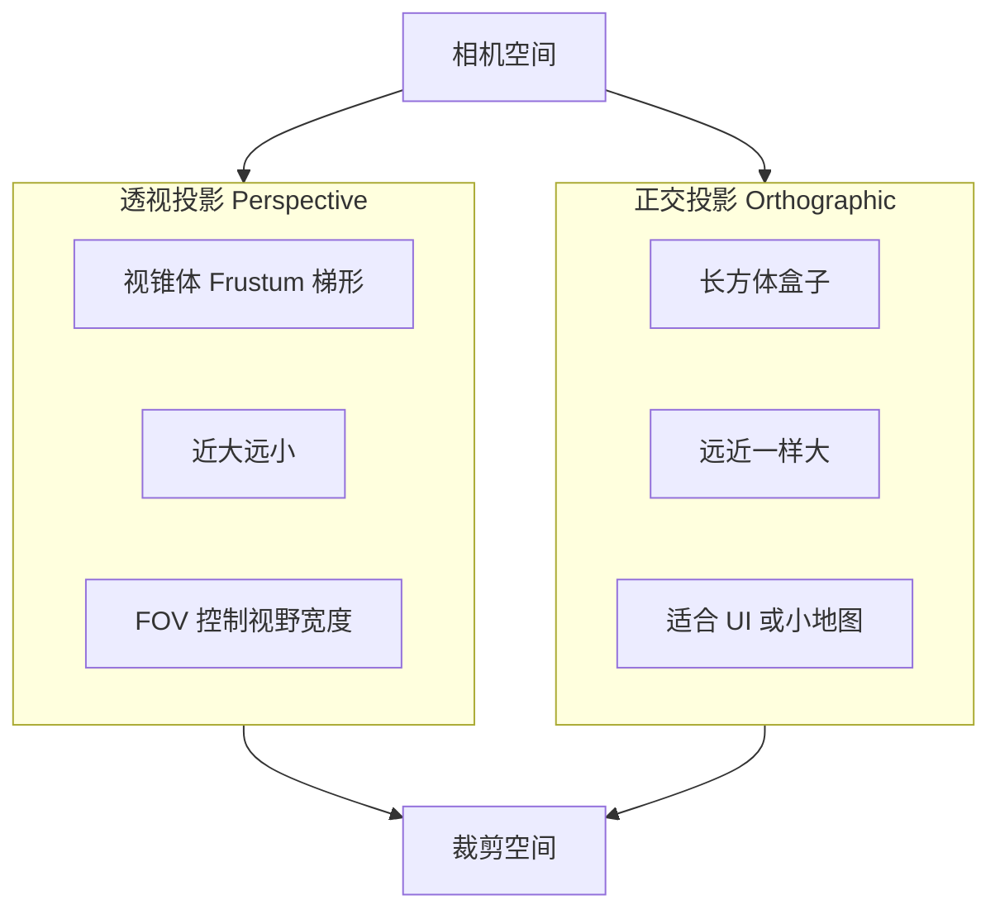
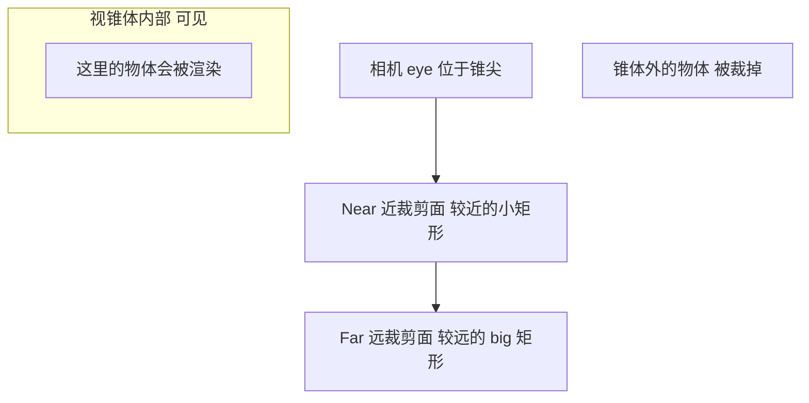
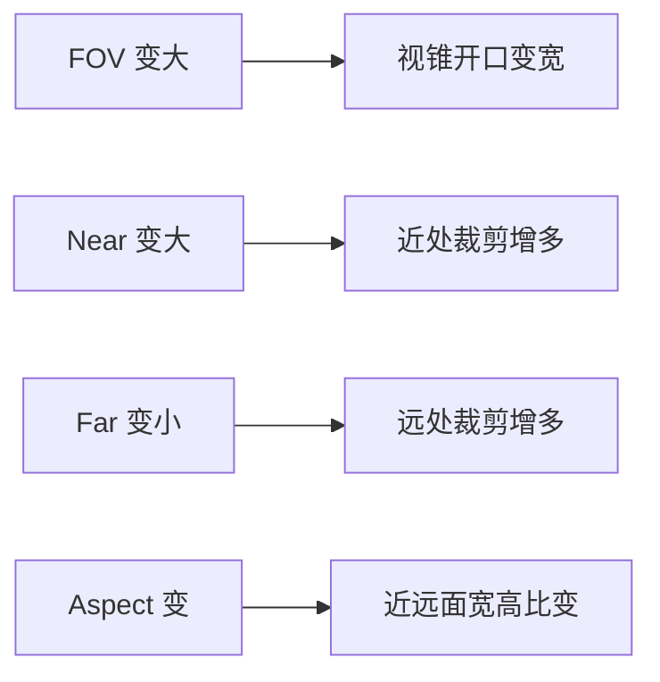

# 04 — 投影矩阵 (Projection Matrix)

## 一句话总结

**投影矩阵回答：如何把相机前方的 3D 场景「拍」成 2D 画面？** 它把视锥体（或正交盒子）里的内容压缩进标准立方体，为最终显示到屏幕做准备。

---

## 生活类比：相机镜头与画框

- **透视投影**：像人眼或相机镜头——**近大远小**，铁路轨道向远处汇聚
- **正交投影**：像工程蓝图——无论远近，同样大小，没有透视感

投影矩阵就是定义这个「镜头」的参数：视野多宽、画框比例、能看多远。

---

## 两种投影方式

| 类型 | 适用场景 | 本项目切换 |
|------|----------|------------|
| 透视 | 3D 游戏、真实感渲染 | Projection 面板 → 「透视」 |
| 正交 | UI、CAD、策略游戏 | Projection 面板 → 「正交」 |

---

## 视锥体 (Frustum)

透视投影的可视区域是一个**截头四棱锥**：

### 关键参数

| 参数 | 含义 | 效果 |
|------|------|------|
| **FOV** (Field of View) | 垂直视野角度 | 越大越「广角」，画面容纳越多 |
| **Aspect** | 宽高比 (宽/高) | 16:9 等，防止画面被拉伸 |
| **Near** | 近裁剪面距离 | 比这更近的物体不显示（太小易精度问题） |
| **Far** | 远裁剪面距离 | 比这更远的物体不显示 |

---

## 透视投影公式（直觉版）

令 `f = 1 / tan(fov/2)`，透视矩阵大致把：

- x 按 `f/aspect` 缩放
- y 按 `f` 缩放
- z 映射到深度缓冲范围
- **w 设为 -z**（相机空间深度），供后续透视除法

透视除法 `x/w, y/w, z/w` 时，**离相机越远的点 w 越大**，除完后在屏幕上越小 → **近大远小**。

---

## 正交投影（直觉版）

把 `[left, right] × [bottom, top] × [near, far]` 的长方体**线性映射**到 NDC 立方体。

- 没有 w 的透视变化（或 w 保持为 1）
- 物体大小不随距离变化

---

## Near / Far 的陷阱

**Q：Near 设太小（如 0.001）会怎样？**

A：深度缓冲精度在 near 附近非常密集，far 附近非常稀疏，容易出现 **Z-fighting**（远近面闪烁重叠）。一般 near 不要太小，far/near 比值不要太大。

**Q：把 Near 从 0.1 改到 2.0 会怎样？**

A：相机前方 2 米以内的物体会被**裁掉**，可能看到模型被「切掉一块」。教学脚本 Step 7 演示此效果。

---

## NDC 深度范围

投影之后做透视除法得到 NDC：

| API | NDC x,y | NDC z (深度) |
|-----|---------|--------------|
| WebGL / OpenGL | [-1, 1] | [-1, 1] |
| DirectX 11 | [-1, 1] | **[0, 1]** |

本项目网页默认 WebGL 约定，可通过顶栏切换 DX11 对照模式，详见 [06-dx11-vs-webgl.md](./06-dx11-vs-webgl.md)。

---

## 视锥体可视化

---

## 对照本项目

| 操作 | 位置 |
|------|------|
| 切换透视/正交 | 左侧 **投影矩阵 (Projection)** → 投影类型 |
| 调节 FOV / 宽高比 / Near / Far | 同面板滑块 |
| 显示视锥体线框 | 勾选「显示视锥体」，中间 3D 视口可见黄色锥体 |
| 看实时数值 | 右侧矩阵看板 **Projection (M_P)**，黄色标签 |
| 教学脚本 Step 6～7 | FOV=95° → near=2, far=40 |

**动手实验：**

1. FOV 从 60° 拉到 95° → 广角效果，视锥变宽，投影矩阵 f 项变化
2. Near 改为 2.0 → 模型近处可能被裁切
3. 取消「显示视锥体」再勾选 → 观察 Near/Far 面与参数联动
4. 切换正交 → 视口角标变为「正交投影」，无近大远小

代码：`src/engine/transforms.js` → `buildProjectionMatrix()`

视锥体绘制：`src/visuals/frustum.js`

---

## 下一步

三个矩阵如何串联 → [05-mvp-pipeline.md](./05-mvp-pipeline.md)
