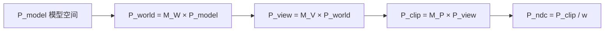
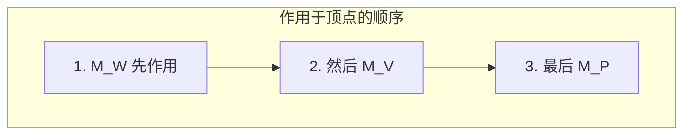

# 05 — MVP 管线：完整变换链

## 一句话总结

**MVP = Model-View-Projection**，三个矩阵连乘，把模型空间的一个顶点，一路变换到裁剪空间，再经透视除法得到 NDC。

---

## 核心公式

```
P_clip = M_P × M_V × M_W × P_model
```

展开写法（与本项目 `buildMVP()` 一致）：

```
MVP = M_P × M_V × M_W
P_clip = MVP × P_model
```

---

## 逐步变换



| 步骤 | 矩阵 | 空间变化 | 颜色（网页标签） |
|------|------|----------|------------------|
| 1 | M_W | 模型 → 世界 | 红色 |
| 2 | M_V | 世界 → 相机 | 青色 |
| 3 | M_P | 相机 → 裁剪 | 黄色 |
| 4 | ÷ w | 裁剪 → NDC | 紫色 |

---

## 乘法顺序：从右到左作用于顶点

列向量约定（Three.js / 本项目）：

```
P_clip = M_P × (M_V × (M_W × P_model))
```

先算最右边的 `M_W × P_model`，再 M_V，再 M_P。



**记忆口诀**：**模型进世界，世界进相机，相机进裁剪** —— W → V → P。

---

## 行主序 vs 列主序

同一个 4×4 矩阵，两种「读法」：

| 存储方式 | 谁在用 | 乘法写法 |
|----------|--------|----------|
| **列主序** (Column-major) | OpenGL、Three.js、HLSL 常量缓冲 | `P' = M × P`（列向量在右） |
| **行主序** (Row-major) | 数学课本、部分 CPU 代码 | 显示时按行阅读更直观 |


Three.js 内部**列主序存储**（`elements` 数组）。本项目矩阵看板可切换：

- **行主序**：方便对照数学公式和教材
- **列主序**：方便对照 GPU 内存布局

HLSL 里若写 `output.pos = mul(worldViewProj, float4(pos, 1))`，是列向量左乘转置形式；与 `M × P` 的矩阵**互为转置**，数值布局不同但几何意义相同。

---

## 透视除法与裁剪

`P_clip = (x, y, z, w)` 之后：

```
x_ndc = x / w
y_ndc = y / w
z_ndc = z / w
```

GPU 还会检查 `-w ≤ x,y,z ≤ w`，超出视锥的点被**丢弃**，不会进入后续光栅化。

| w 的情况 | 含义 |
|----------|------|
| w > 0 | 点在相机前方，正常透视除法 |
| w ≈ 0 | 除法不稳定 |
| w < 0 | 点在相机后方，通常被裁掉 |

---

## 视口变换（MVP 之后）

NDC 到屏幕像素（API 自动完成，本项目 Three.js 处理）：

```
screen_x = (x_ndc + 1) / 2 × viewportWidth
screen_y = (1 - y_ndc) / 2 × viewportHeight   // Y 轴常翻转
```

这一步不在 MVP 矩阵里，但 completes 从顶点到像素的旅程。

---

## 在 DX11 里怎么用？

典型 HLSL 顶点着色器（概念示意）：

```hlsl
float4 posWorld  = mul(float4(input.pos, 1), worldMatrix);
float4 posView   = mul(posWorld, viewMatrix);
float4 posClip   = mul(posView, projectionMatrix);
// 或直接
float4 posClip   = mul(float4(input.pos, 1), worldViewProjection);
output.pos = posClip;
```

常量缓冲里上传的 `worldViewProjection` 就是 CPU 端算好的 MVP（注意 HLSL 矩阵乘法顺序与 API 约定）。

---

## 对照本项目

| 功能 | 位置 |
|------|------|
| 四个矩阵实时数值 | 右侧矩阵看板：World / View / Projection / **MVP** |
| MVP 公式说明 | 右侧 **公式说明 → MVP** 标签 |
| 逐步追踪一个点 | 左侧 **坐标追踪** |
| 行/列主序切换 | 矩阵看板上方按钮 |
| 教学脚本 Step 8 | MVP 链路总结，等轴测视角 |

**动手实验：**

1. 设置一组明显的 World + View + Projection 参数
2. 在坐标追踪输入 `(1, 1, 1)`，手动验算：
   - 世界空间 = M_W × (1,1,1,1)
   - 与追踪面板第二行对比
3. 切换行主序 / 列主序，理解**同一矩阵两种读法**
4. 看 MVP 块：它应等于 P × V × W 的连乘结果

代码：

- `buildMVP()` — MVP 连乘
- `tracePoint()` — 完整追踪链
- `matrixToRows()` / `matrixToColumns()` — 两种显示格式

---

## 下一步

了解 DX11 与 WebGL 的具体差异 → [06-dx11-vs-webgl.md](./06-dx11-vs-webgl.md)

动手练习 → [07-practice-guide.md](./07-practice-guide.md)
