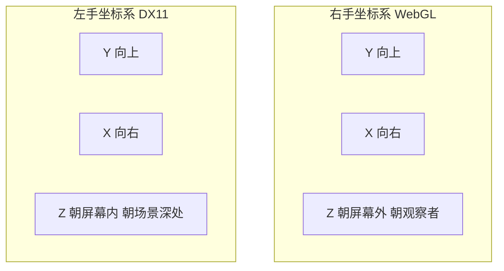
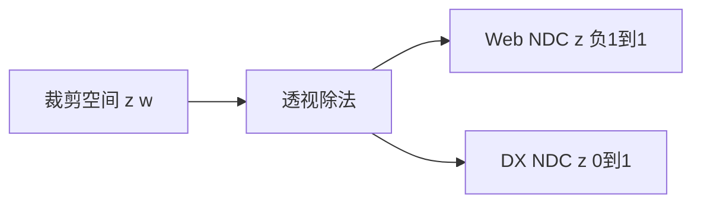
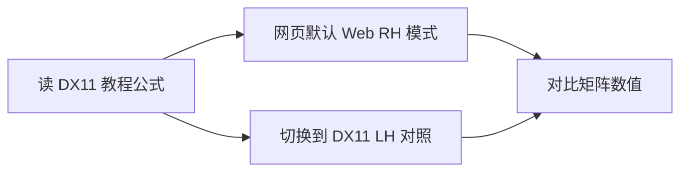

# 06 — DX11 与 WebGL 的差异

## 一句话总结

**变换链路的原理相同**，但 DirectX 11 与 WebGL/OpenGL 在**坐标系 handedness、NDC 深度范围、矩阵乘法约定**上有差异——学 DX11 时看到这些不同点就不会困惑。

---

## 为什么要单独讲这一章？

本项目的交互网页用 **Three.js / WebGL** 实现，默认是：

- 右手坐标系 (Right-Handed, RH)
- Y 轴朝上
- NDC 深度 z ∈ [-1, 1]

而 DX11 官方文档、HLSL 示例、多数中文教程默认：

- **左手坐标系** (Left-Handed, LH)
- Y 轴朝上（与 DX 一致）
- NDC 深度 z ∈ **[0, 1]**

数值看起来不同，**几何意义一样**。本项目提供「DX11 对照模式」帮助对照。

---

## 差异对照表

| 项目 | WebGL / 本项目默认 | DirectX 11 |
|------|-------------------|------------|
| 坐标系 | 右手 (RH) | 左手 (LH) |
| Y 轴 | 向上 | 向上 |
| Z 轴朝向 | +Z 朝屏幕外（朝你） | +Z 朝屏幕内（朝场景深处） |
| NDC x, y | [-1, 1] | [-1, 1] |
| NDC z (深度) | **[-1, 1]** | **[0, 1]** |
| 顶点乘法 (常见) | `P' = M × P` 列向量 | HLSL `mul(v, M)` 行向量 |
| 矩阵内存布局 | 列主序常见 | 行主序常见（HLSL 默认） |

---

## 左手系 vs 右手系



**记忆方法**：伸出右手，拇指 X、食指 Y、中指 Z → 右手系。左手同理 → 左手系，**Z 方向相反**。

从 RH 到 LH 的常见转换：对 Z 轴取反（乘以 diag(1, 1, -1, 1)）。

---

## NDC 深度范围

同一裁剪空间点，透视除法后：

| API | z_ndc 范围 | 近截面 near | 远截面 far |
|-----|------------|-------------|------------|
| WebGL | -1 ~ +1 | 通常映射到 -1 | 通常映射到 +1 |
| DX11 | **0 ~ 1** | 通常映射到 0 | 通常映射到 1 |



深度测试、深度缓冲写入时，DX11 用 [0,1] 更方便（0=最近，1=最远，与浮点直觉一致）。

---

## 矩阵乘法与转置

同一几何变换，在不同 API 里矩阵**数值布局可能互为转置**：

```
WebGL:  P' = M × P        （列向量 P 在右边）
HLSL:   P' = P × M        （行向量 P 在左边）
```

因此：

- 教材里的行主序公式 ↔ GPU 常量缓冲里的列主序数据，需要**转置**才能对应
- 本项目矩阵看板的「行主序 / 列主序」切换，就是为对照这两种读法

---

## 本项目的 DX11 对照模式

顶栏按钮 **「坐标系: Web RH」** 可切换为 **「DX11 LH」**。

实现思路（`buildDisplayMatrices()`，仅用于**教学展示**，不改变 Three.js 实际渲染）：

1. **RH → LH**：仿射矩阵用 `C × M × C` 转换（C 为 Z 取反矩阵）
2. **深度范围**：投影矩阵额外乘以 GL→DX 深度映射矩阵

```javascript
// Z 轴取反：右手 ↔ 左手
RH_TO_LH = diag(1, 1, -1, 1)

// NDC 深度：[-1,1] → [0,1]
GL_TO_DX_DEPTH = ...
```

切换后，右侧矩阵看板和坐标追踪的数值会变为 **DX11 风格对照值**，方便与 MSDN / 教程公式比对。

---

## 学 DX11 时怎么用本项目？



建议流程：

1. 先在 **Web RH** 模式下理解 W / V / P 的几何意义
2. 读 DX11 文档时，切换到 **DX11 LH**，看矩阵数值如何变化
3. 重点理解：**变化的是坐标约定，不是变换逻辑**

---

## 常见疑问

**Q：我按 DX11 公式算出来的矩阵和网页不一样，是不是错了？**

A：先检查：是否同一坐标系（RH/LH）？是否同一主序（行/列）？是否 NDC 深度范围一致？三项对齐后应能对应。

**Q：实际写 DX11 代码还要自己转坐标系吗？**

A：DirectXMath、`XMMatrixLookAtLH`、`XMMatrixPerspectiveFovLH` 等 API 已封装 LH 约定。理解 RH/LH 差异是为了**读文档和 debug**，不是让你手算每个矩阵。

**Q：Three.js 和 DX11 能共用同一套矩阵吗？**

A：通常不能原样复制，需要按 API 做坐标系和转置转换。原理相同，数值需适配。

---

## 对照本项目

| 功能 | 位置 |
|------|------|
| 切换 RH / DX11 LH | 顶栏 **「坐标系: Web RH」** 按钮 |
| 行/列主序 | 矩阵看板上方 |
| 对照后的追踪数值 | 坐标追踪（切换坐标系后重新追踪） |

代码：`src/engine/transforms.js` → `buildDisplayMatrices()`、`convertTraceForDisplay()`

---

## 下一步

按步骤动手练习 → [07-practice-guide.md](./07-practice-guide.md)
