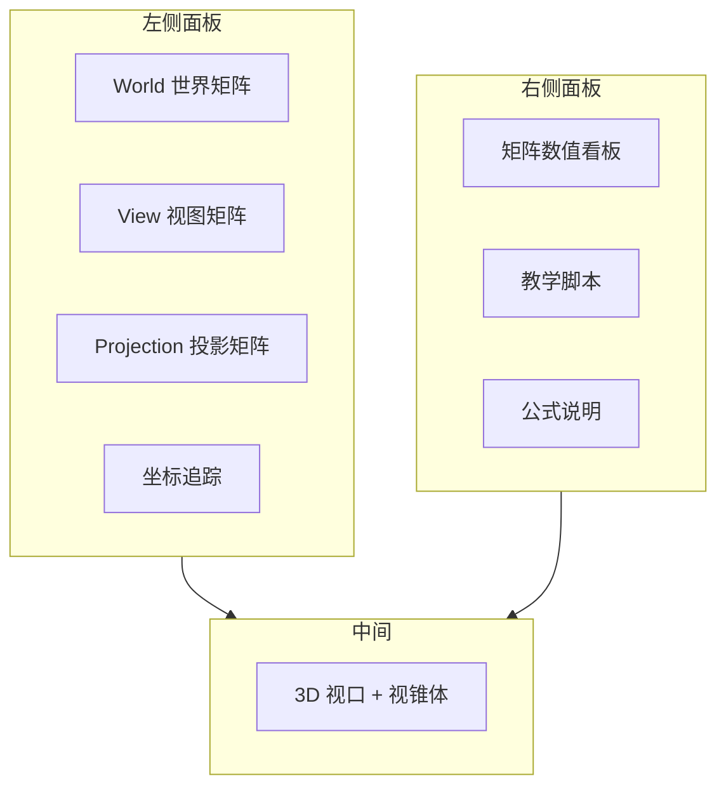

# 07 — 实操指南：配合网页动手学

## 一句话总结

**先跑起来，再跟着 8 步教学脚本走一遍**，配合坐标追踪和矩阵看板，把文档里的概念变成「看得见、摸得着」的体验。

---

## 启动项目

在项目根目录：

```bash
npm install
npm run dev
```

浏览器打开 http://localhost:5173/

更完整的运行说明见根目录 [README.md](../README.md)。

---

## 网页布局速览



---

## 推荐学习路线（约 60 分钟）

| 阶段 | 时间 | 做什么 |
|------|------|--------|
| 1 | 10 min | 读 [00-introduction](./00-introduction.md) + [01-coordinate-spaces](./01-coordinate-spaces.md) |
| 2 | 15 min | 教学脚本 8 步（见下表） |
| 3 | 15 min | 自由调节 + 坐标追踪验证 |
| 4 | 10 min | 读 [05-mvp-pipeline](./05-mvp-pipeline.md)，对照 MVP 矩阵 |
| 5 | 10 min | 切换 DX11 对照模式，读 [06-dx11-vs-webgl](./06-dx11-vs-webgl.md) |

---

## 教学脚本 8 步详解

右侧 **「教学脚本」** → 点 **「开始脚本」**，用「上一步 / 下一步」逐步推进。

| 步骤 | 脚本内容 | 对应文档 | 观察重点 |
|------|----------|----------|----------|
| 1/8 | 模型空间到世界空间，全部重置 | [01](./01-coordinate-spaces.md) [02](./02-world-matrix.md) | 四个矩阵接近单位矩阵，模型在原点 |
| 2/8 | World 平移 tx=3, ty=1, tz=-2 | [02](./02-world-matrix.md) | 世界矩阵**第四列**变化，模型位移 |
| 3/8 | Yaw=45°, Pitch=20°, Scale=1.5 | [02](./02-world-matrix.md) | 3×3 **旋转块**和对角线缩放 |
| 4/8 | 侧视预设 | [03](./03-view-matrix.md) | View 变、World 不变，理解「观察系变换」 |
| 5/8 | pitch=40, distance=16 | [03](./03-view-matrix.md) | 俯视角度、相机距离与 View 矩阵 |
| 6/8 | 透视 FOV=95° | [04](./04-projection-matrix.md) | 广角效果，投影矩阵 f 项 |
| 7/8 | near=2, far=40 | [04](./04-projection-matrix.md) | 近处裁切、视锥体变短 |
| 8/8 | 等轴测 + MVP 总结 | [05](./05-mvp-pipeline.md) | 公式说明切到 MVP 标签 |

每步完成后，看右侧 **公式说明** 对应标签，对照文字描述。

---

## 坐标追踪练习

1. 左侧 **坐标追踪** 输入 `(1, 1, 1)`
2. 点 **「追踪」**
3. 记录五行的数值
4. 只改 World 的 tx → 追踪，确认只有「世界空间」及之后的行变化
5. 只改 View 的 yaw → 确认「相机空间」及之后变化
6. 只改 FOV → 确认「裁剪空间」和 NDC 变化

这是验证 MVP 链最直观的方式。

---

## 同一套 MVP，观察不同模型的差异

这一组练习专门用来验证：**矩阵链路本身没有变，但不同模型会让你更容易观察到不同类型的视觉结果。**

### 练习目标

在 **立方体 / 球体 / 圆柱** 三种模型之间切换，保持同一组 World、View、Projection 参数不变，对比：

- 哪些是**矩阵数值层面完全一致**的
- 哪些是**画面观感上更容易察觉**的
- 哪些差异来自模型形状，而不是来自变换公式本身

### 操作步骤

1. 先按 **R** 重置全部参数。
2. 在左侧 World 面板里依次切换 **立方体 → 球体 → 圆柱**。
3. 每切换一次，都点一次 **「使用推荐点」**，再点 **「追踪」**。
4. 保持 Projection 为透视投影，设置：`FOV=60`、`near=0.1`、`far=100`。
5. 设置 World：`tx=2`、`ty=1`、`rz=20`、`ry=45`、`scale=1.2`。
6. 设置 View：使用 **等轴测** 预设，或 `distance=10`、`pitch=35`、`yaw=45`。
7. 观察中间视口、右侧矩阵看板和坐标追踪结果。

### 你应该看到什么

#### 1. 矩阵看板几乎只由参数决定，不由模型类型决定

如果你没有改动 World / View / Projection 参数，那么：

- `M_W` 不会因为“立方体换成球体”而改变
- `M_V` 不会因为模型类型改变而改变
- `M_P` 也不会因为模型类型改变而改变
- `MVP = M_P × M_V × M_W` 同样保持一致

这正好说明：**MVP 是“怎么变换坐标”的规则，不是“模型长什么样”的描述。**

#### 2. 视口里的观感会不同，因为几何轮廓不同

- **立方体** 更适合观察：旋转后边和角的朝向变化、缩放后的棱角轮廓
- **球体** 更适合观察：透视投影下近大远小的体感，但不容易从外轮廓看出旋转
- **圆柱** 更适合观察：旋转后顶部圆面、侧面方向和高度比例的变化

这说明：**同一套矩阵会作用在所有顶点上，但不同顶点分布会形成不同的视觉反馈。**

#### 3. 坐标追踪看的是“点的变换”，不是“整个模型的外观”

当你点 **「使用推荐点」** 后：

- 立方体会选一个角点，便于观察顶点从 Model 到 NDC 的完整位移
- 球体会选顶部点，便于观察曲面代表点的高度变化
- 圆柱会选上边缘点，便于观察横向半径和纵向高度一起参与变换

追踪结果中最值得比较的是：

- World 改变时，推荐点在世界空间的位置如何变化
- View 改变时，这个点在相机空间中的前后左右上下如何变化
- Projection 改变时，NDC 的压缩方式如何变化

### 一个推荐对照实验

按下面顺序切换模型，并回答问题：

1. 先用 **立方体**，设置 `ry=45`，观察为什么旋转感最明显。
2. 切到 **球体**，保持相同参数，观察为什么矩阵变了但“旋转感”弱了很多。
3. 切到 **圆柱**，再观察为什么它既能看出旋转，又没有立方体那么强的棱角提示。

如果你能回答这个问题，就说明你已经区分开了：

- **矩阵层面的变化**
- **几何形状带来的视觉差异**

### 学习结论

这组练习的核心不是比较“哪个模型更好看”，而是建立下面这个判断：

> 同一套 MVP 公式对所有模型都成立，区别只在于模型顶点分布不同，所以我们看到的轮廓、旋转提示和透视感会不同。

这是从“会调参数”走向“真正理解渲染管线”的关键一步。

---

## 矩阵看板技巧

| 按钮 | 用途 |
|------|------|
| **行主序** | 对照数学课本、中文教程公式 |
| **列主序** | 对照 GPU 内存、Three.js elements |
| **2位 / 4位 / 全** | 控制显示精度 |
| **MVP 块** | 验证是否等于 P×V×W |

练习：在 Step 3 完成后，手动心算 M_W 第四列是否约为 (3, 1, -2, 1)（考虑旋转后平移列会更复杂）。

---

## 其他功能

### 演示模式

- 顶栏 **「演示」** 或按 **空格**
- 自动播放预设参数动画，适合复习整体效果

### 视角预设快捷键

| 键 | 视角 |
|----|------|
| 1 | 正视 |
| 2 | 侧视 |
| 3 | 俯视 |
| 4 | 等轴测 |

### 导入 / 导出

- 顶栏 **「导出」**：保存当前全部参数为 JSON
- **「导入」**：恢复之前保存的状态，方便分享实验配置

### 全部重置

- 按 **R** 或顶栏 **「重置」**

---

## 自测清单

学完一遍后，试着不看文档回答：

- [ ] 模型空间和世界空间有什么区别？
- [ ] 世界矩阵由哪三种变换组成？顺序是什么？
- [ ] 为什么说 View 矩阵是相机矩阵的逆？
- [ ] FOV、Near、Far 各自影响什么？
- [ ] MVP 乘法从右到左作用顺序是什么？
- [ ] DX11 和 WebGL 的 NDC 深度范围有什么不同？
- [ ] 行主序和列主序显示的是同一个矩阵吗？

---

## 进一步学习 DX11

文档建立直觉后，建议继续：

1. **DirectXMath** — `XMMatrixTranslation`、`XMMatrixLookAtLH`、`XMMatrixPerspectiveFovLH`
2. **HLSL 顶点着色器** — 常量缓冲上传 WorldViewProjection
3. **MSDN 文档** — 坐标系、视口、深度缓冲

本项目的矩阵数值可作为「手算 / API 输出」的参照基准。

---

## 文档索引

返回 [docs/README.md](./README.md) 查看完整文档目录。
