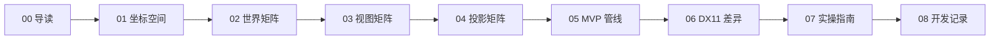

# DX11 渲染矩阵 — 学习文档

一套面向初学者的通俗图文教程，配合本仓库的 [交互可视化网页](../README.md) 一起学习 DirectX 11 / 三维渲染中的核心矩阵概念。

## 推荐阅读顺序

| 顺序 | 文档 | 一句话 |
|------|------|--------|
| 1 | [00-introduction.md](./00-introduction.md) | 3D 渲染在做什么，为什么需要矩阵 |
| 2 | [01-coordinate-spaces.md](./01-coordinate-spaces.md) | 一个顶点从模型空间到屏幕像素要经过哪些「地址」 |
| 3 | [02-world-matrix.md](./02-world-matrix.md) | 物体在场景里在哪、朝哪、多大 |
| 4 | [03-view-matrix.md](./03-view-matrix.md) | 相机怎么看这个世界 |
| 5 | [04-projection-matrix.md](./04-projection-matrix.md) | 如何把 3D 场景「拍」成 2D 画面 |
| 6 | [05-mvp-pipeline.md](./05-mvp-pipeline.md) | World + View + Projection 如何串成完整管线 |
| 7 | [06-dx11-vs-webgl.md](./06-dx11-vs-webgl.md) | DX11 与 WebGL 的坐标系、深度、矩阵约定差异 |
| 8 | [07-practice-guide.md](./07-practice-guide.md) | 如何配合网页动手验证每个概念 |

## 开发记录

- [08-feature-development-log.md](./08-feature-development-log.md) — 记录模型切换、坐标追踪兼容与教学脚本兼容这次迭代的目标、实现与验证建议

## 怎么学最高效

1. **先读** [00-introduction.md](./00-introduction.md) 和 [01-coordinate-spaces.md](./01-coordinate-spaces.md)，建立整体地图。
2. **再开网页**：在项目根目录运行 `npm install && npm run dev`，打开 http://localhost:5173/
3. **边读边调**：读 02～04 时，对照左侧 World / View / Projection 面板和右侧矩阵看板。
4. **动手验证**：用 [07-practice-guide.md](./07-practice-guide.md) 里的教学脚本 8 步走一遍。
5. **深入 DX11**：读 [06-dx11-vs-webgl.md](./06-dx11-vs-webgl.md)，打开网页顶栏「坐标系: Web RH / DX11 LH」对照数值。

## 文档与网页功能对照

| 文档章节 | 网页面板 / 功能 |
|----------|----------------|
| 02 世界矩阵 | 左侧 World 面板、矩阵看板 M_W、公式说明 World 标签 |
| 03 视图矩阵 | 左侧 View 面板、视角预设、矩阵看板 M_V |
| 04 投影矩阵 | 左侧 Projection 面板、视锥体可视化、矩阵看板 M_P |
| 05 MVP 管线 | 矩阵看板 MVP、坐标追踪、公式说明 MVP 标签 |
| 06 DX11 差异 | 顶栏「坐标系」切换、行/列主序切换 |
| 07 实操指南 | 教学脚本、演示模式、导入/导出 |

## 代码参考

文档中的公式与项目实现一致，核心逻辑在：

- [`src/engine/transforms.js`](../src/engine/transforms.js) — 矩阵计算
- [`src/ui/tutorial-script.js`](../src/ui/tutorial-script.js) — 8 步教学脚本
- [`src/ui/coordinate-tracker.js`](../src/ui/coordinate-tracker.js) — 坐标追踪
